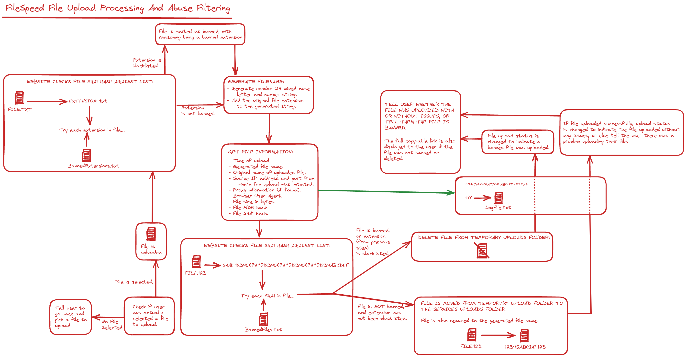

# FileSpeed

## What is FileSpeed?

FileSpeed is a simple file sharing website that uses randomly generated filenames for shareable links. The website is built with PHP and features a SHA1 upload blacklist and extensive logging. 

FileSpeed was created for a midterm project. This version has been modified to remove in-jokes and other unrelated content. 

## Setup:

1) Download the FileSpeed website source files.
2) Download, install and configure PHP and a web server of your choice.
3) Copy the website to the web root directory.
4) Set permissions:
    - Ensure the `/configuration/` folder is not accessible to the public.
    - Ensure that all content in the `/uploads/` folder cannot be executed by the server.
5) Test the website by uploading a file.

The log file is stored at `/configuration/log.txt`.

If you wish to test the file blacklist (and the SHA1 hash for the blacklist test file is still in `badfilesha1.txt`), you can upload the file at `/other/FileSpeed-Blacklist-Test.txt` and the website should tell you that the file is banned.

## Backend Architecture:

This diagram is intended to demonstrate the file uploading process in `/public/uploader.php`.

## Contributing:

Please note the following when contributing:

- When editing the backend architecture diagram, please use [Excalidraw](https://excalidraw.com/) and include the save file in your pull request. You can find the save file at `/other/backend.excalidraw`.

## License:

Licensed under [GNU General Public License v3.0](https://www.gnu.org/licenses/gpl-3.0.en.html).